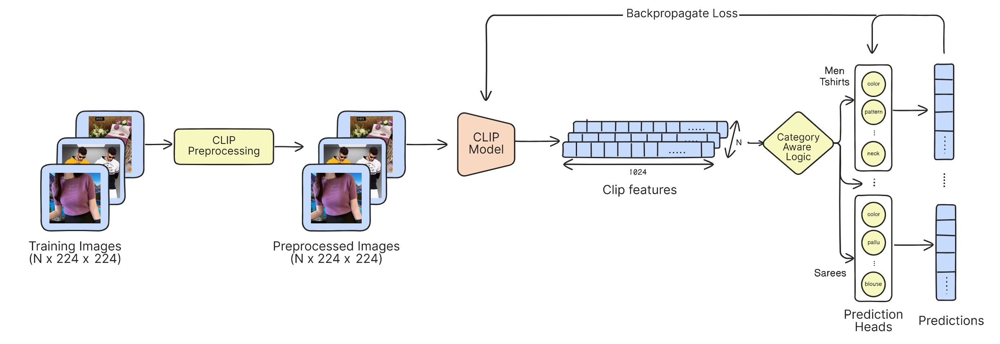
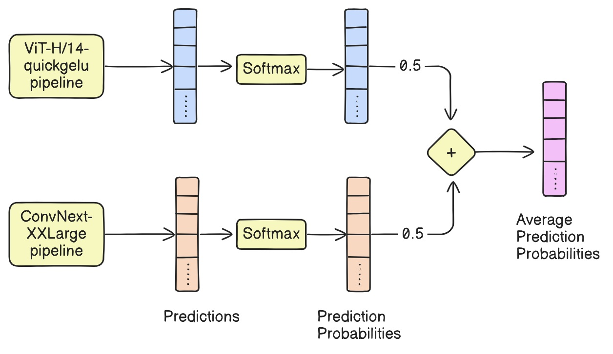

## Getting Started

## Environment Setup

- Install Python 3.10+ and set up a virtual environment
- Install PyTorch with CUDA support:
  ```bash
  pip install torch==2.4.1 torchvision==0.19.1 --index-url https://download.pytorch.org/whl/cu121
  ```
- Ensure you have a CUDA-capable GPU (minimum 8GB VRAM)
- Install all dependencies: `pip install -r requirements.txt`

### Configuration

Before running any scripts, configure the training parameters in `config.yaml`

### Training

#### Option 1: Training with Validation

This approach is recommended during the development phase:

```bash
python train_with_val.py
```

This will:

- Split the data into 90% training and 10% validation
- Provide validation metrics after each epoch

#### Option 2: Full Dataset Training

Use this for final model training:

```bash
python main.py
```

This will:

- Train on the complete dataset
- Save model checkpoints periodically
- Generate training metrics

### Inference

#### Load Model Checkpoint

Download the pre-trained model :
[ViT-H14-quickgelu Checkpoint File]
[convnext-xxlarge Checkpoint File]

#### To run inference on test data:

```bash
python inference.py \
    --input_csv /path/to/input.csv \
    --image_dir /path/to/images \
    --model_path_convnext /path/to/convnext_model \
    --model_path_gelu /path/to/gelu_model \
    --output_csv output.csv \
    --batch_size 32 \
    --cache_dir /path/to/cache
```

#### Inference Parameters

- `input_csv`: Path to the test data CSV file
- `image_dir`: Directory containing test images
- `model_path_convnext`: Path to the trained OpenClip convnext-xxlarge model `.pth` file
- `model_path_gelu`: Path to the trained OpenClip ViT-H14-quickgelu model `.pth` file
- `output_csv`: Path for saving predictions
- `batch_size`: Number of images to process simultaneously
- `cache_dir`: Directory for storing temporary files


## Model Architecture


<div style="display: flex; align-items: flex-start;">
  
  <p>
    Our final model is a weighted ensemble of two cutting-edge architectures: ViT-H/14-quickgelu and
    ConvNext-XXLarge. The predictions from these models were combined using a weighted averaging
    mechanism to optimize overall performance. Details of architecture can be viewed from the table below.
  </p>
</div>


## Key Features

| Model Architecture           | Description                                                                                                                        | Strengths                                               |
| ---------------------------- | ---------------------------------------------------------------------------------------------------------------------------------- | ------------------------------------------------------- |
| **ViT-H/14-quickgelu** | A transformer-based model optimized for fine-grained feature extraction, excelling at capturing intricate patterns in visual data. | Ideal for attribute recognition tasks.                  |
| **ConvNext-XXLarge**   | A convolutional model known for its strong classification power, performing well on datasets with complex class distributions.     | Robust classification capabilities in diverse datasets. |

## Results

Please refer to the table below for the leaderboard results.

## Model Performance Comparison

| **Approach Type**                                      | **Model & Technique**                     | **Public Score** | **Private Score** |
| ------------------------------------------------------------ | ----------------------------------------------- | ---------------------- | ----------------------- |
| **VQA using VLM**                                      | Finetuned Qwen2VL-7B (instruct model using VQA) | 0.551                  | 0.583                   |
| **Image Similarity Based Search with Majority Voting** | Hashing                                         | 0.337                  | 0.342                   |
|                                                              | SeResNext model and Faiss                       | 0.670                  | 0.669                   |
|                                                              | Swin Transformer and Faiss                      | 0.606                  | 0.605                   |
|                                                              | Frozen ClipViT B/32                             | 0.723                  | 0.724                   |
|                                                              | Frozen ClipViT L/14                             | 0.777                  | 0.778                   |
| **Classification Based w/ MLP Head**                   | ClipViT-B/32                                    | 0.765                  | 0.765                   |
|                                                              | ClipViT-L/14                                    | 0.770                  | 0.771                   |
|                                                              | ClipViT-L/14 optimal params                     | 0.785                  | 0.785                   |
|                                                              | ClipViT-L/14 w/background removal               | 0.782                  | 0.779                   |
|                                                              | Coca                                            | 0.797                  | 0.794                   |
|                                                              | ConvNext-XXLarge                                | 0.801                  | 0.799                   |
|                                                              | ViT-H/14-quickgelu                              | **0.806**        | **0.800**         |
| **Ensemble Based**                                     | ViT-H/14-quickgelu + Coca                       | 0.804                  | 0.801                   |
|                                                              | ConvNext-XXLarge + ViT-H/14-quickgelu           | **0.807**        | **0.802**         |


